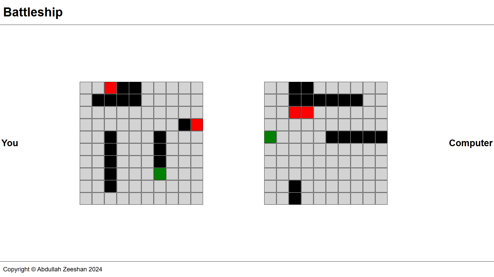

# Battleship

## About 

Implementation of the '[Battleship](https://en.wikipedia.org/wiki/Battleship_(game))' game using TDD.

**[LIVE](https://4bdullah7eeshan.github.io/battleship/)**



## Features

- Random placement of user's ships
- Computer's ships are visible to easy try outs
- Play game with the mouse clicks
- Game over screen
- Restart game

## Future Improvements

- Improve styling and UI. Currently I went with a [Brutalist Design](https://brutalistwebsites.com/).
- Place a button to toggle computers' ship's visibility.
- Add game instructions.

## Technologies

- HTML
- CSS
- JavaScript
- Webpack
- Jest

## Getting Started

```
git clone https://github.com/4bdullah7eeshan/battleship.git
cd battleship
npm install
npm run serve
```


